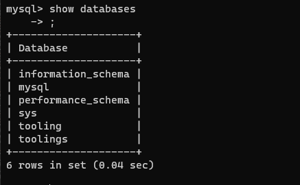
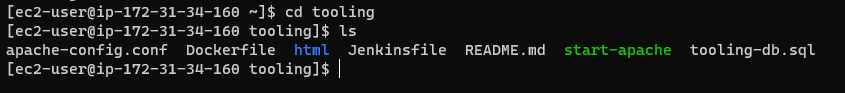
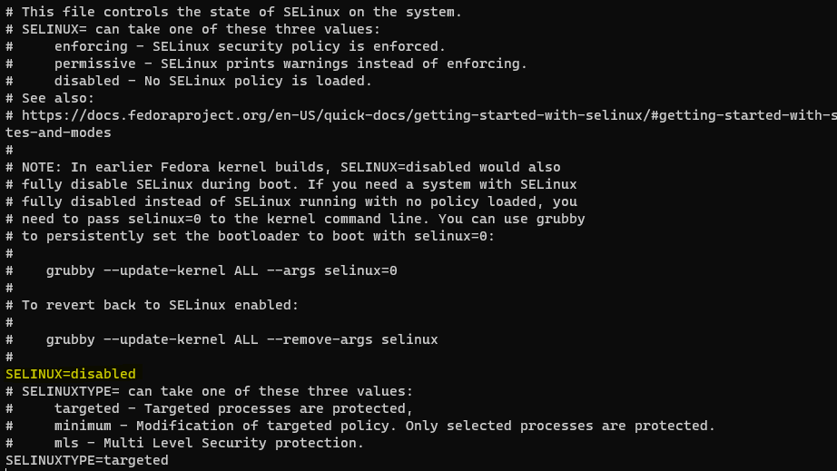

## **DevOps Tooling Website Architecture**

In this project we will be hosting a devops website in webservers as shown in the architecture below.


To go about this we will prepare a Network File System Server (NFS Server) where we will attach 3 AWS volumes to the server instance using Logical Volume Management. Next we will configure a database sever which will work with 3 web servers.

 **A --PREPARE NFS SERVER**

 1. We will spin up an EC2 instance with RHEL OS. We will configure 3 volumes and attache them to the NFS instance where we will configure a logical volume.

2. We will format the disk as `xfs` and name the logical volumes as lv-opt, lv-apps and lv-logs as shown below.


Mount lv-apps on /mnt/apps – To be used by webservers
Mount lv-logs on /mnt/logs – To be used by webserver logs
Mount lv-opt on /mnt/opt – To be used by Jenkins


3. Next we will install NFS Server, enable and start the service using the below codes.

``````
sudo yum -y update
sudo yum install nfs-utils -y
sudo systemctl start nfs-server.service
sudo systemctl enable nfs-server.service
sudo systemctl status nfs-server.service
``````

We need to confirm if the NFS Server service is working


4. We have to make sure that permissions are set up properly on the NFS server so that our web servers can read to, write to and execute files on the NFS.

``````
sudo chown -R nobody: /mnt/apps
sudo chown -R nobody: /mnt/logs
sudo chown -R nobody: /mnt/opt

sudo chmod -R 777 /mnt/apps
sudo chmod -R 777 /mnt/logs
sudo chmod -R 777 /mnt/opt

sudo systemctl restart nfs-server.service
``````
Now, we will configure access to NFS for clients within the same subnet.

``````
sudo vi /etc/exports
/mnt/apps 172.31.32.0/20(rw,sync,no_all_squash,no_root_squash)
/mnt/logs 172.31.32.0/20(rw,sync,no_all_squash,no_root_squash)
/mnt/opt  172.31.32.0/20(rw,sync,no_all_squash,no_root_squash)

Esc + :wq!

sudo exportfs -arv
``````
5. Next we check which port is used by NFS and open it using secuity goup. 


 **B --CONFIGURE THE DATABASE SERVER**

 1. We will install and configure the MYSQL DBMS to work with the remote web server.

 ``````
    sudo yum install mysql-server -y
	sudo systemctl start mysqld
	sudo systemctl enable mysqld
 ``````
2. Create a database name it tooling. Create a database user and name it webaccess. Grant permission to webaccess user on tooling database to do anything only from the webservers subnet CIDR.

``````
    sudo mysql
	CREATE DATABASE tooling;
	CREATE USER `webaccesss`@`172.31.32.0/20` IDENTIFIED BY 'password';
	GRANT ALL ON tooling.* TO 'webaccesss'@'172.31.32.0/20';
	FLUSH PRIVILEGES;
	Show databases;
``````



`select user, host from mysql.user` --- show you a table of users and it host


**C --PREPARE THE WEB SERVERS**

We need to make sure that our Web Servers can serve the same content from shared storage solutions, in our case – NFS Server and MySQL database. Here we will configure the NFS client on the three web servers. Deploy a tooling application to our web servers into our shared NFS folder and finally configure the web server to work with a single MySQL database.

1. First lets launch a new 3 EC2 instance with RHEL 8 OS.
2. Install NFS client

    `sudo yum install nfs-utils nfs4-acl-tools -y`

3. Mount `/var/www/` and target the NFS serve's expot for apps.

``````
sudo mkdir /var/www
sudo mount -t nfs -o rw,nosuid <NFS-Server-Private-IP-Address>:/mnt/apps /var/www
``````

4. Verify that NFS was mounted successfully by running `df -h`. Make sure that the changes will persist on Web Server after reboot.

    `sudo vi /etc/fstab`    
    `<NFS-Server-Private-IP-Address>:/mnt/apps /var/www nfs defaults 0 0`

5. Install Remi’s repository, Apache and PHP (http://www.servermom.org/how-to-enable-remi-repo-on-centos-7-6-and-5/2790/)

``````
sudo yum install httpd -y

sudo dnf install https://dl.fedoraproject.org/pub/epel/epel-release-latest-8.noarch.rpm

sudo dnf install dnf-utils http://rpms.remirepo.net/enterprise/remi-release-8.rpm

sudo dnf module reset php

sudo dnf module enable php:remi-7.4

sudo dnf install php php-opcache php-gd php-curl php-mysqlnd

sudo systemctl start php-fpm

sudo systemctl enable php-fpm

setsebool -P httpd_execmem 1
``````

We need to repeat step 1-5 in the two other web servers.

6. Verify that Apache files and directories are available on the Web Server in /var/www and also on the NFS server in /mnt/apps. If you see the same files – it means NFS is mounted correctly. You can try to create a new file touch test.txt from one server and check if the same file is accessible from other Web Servers.

7. Next we will locate the log folder for Apache on the webserver which is `/var/log/httpd` and mount it to NFS server's export for logs which is `lv-logs`. Repeat step № 3 and 4 to make sure the mount point will persist after reboot.

``````
sudo ls /var/log/httpd
sudo mount -t nfs -o rw,nosuid <NFS-Server-Private-IP-Address>:/mnt/logs /var/log/httpd
``````
`sudo vi /etc/fstab`    
    `<NFS-Server-Private-IP-Address>:/mnt/logs /var/log/httpd nfs defaults 0 0`

8. Fork the tooling source code from Darey.io Github Account to your Github account. (https://github.com/darey-io/tooling.git)

9. Deploy the tooling website’s code to the Webserver. Ensure that the html folder from the repository is deployed to /var/www/html



`sudo cp -R html/. /var/www/html`

copies all the content in html into var/www/html. Please before doing this confirm that the var/www/html is empty

`ls /var/www/html`

When we run the above code after the copy we see the below


**Note 1:**  Do not forget to open TCP port 80 on the Web Server and MYSQL port in DB security group. This is done in the security group inbund rule.

**Note 2:** If you encounter 403 Error – check permissions to your /var/www/html folder and also disable SELinux sudo setenforce 0
To make this change permanent – open following config file sudo vi /etc/sysconfig/selinux and set SELINUX=disabledthen restrt httpd.



10. Update the website’s configuration to connect to the database (in /var/www/html/functions.php file). Apply tooling-db.sql script to your database using this command

`mysql -h <databse-private-ip> -u <db-username> -p <db-pasword> < tooling-db.sql`

The website configuration in function.php


The tooling-db.sql is an sql script that will run when the above code is initiated.

Also add a binding address using the code below

`sudo vi /etc/mysql/mysql.conf.d/mysqld.cnf`


The restart mysql

`sudo systemctl restat mysql`

`sudo systemctl status mysql`

Checking the database using `show databases` and swtiching to a table using `use <table name>`. After that we select a user using `select * from users`


Using this user i am able to log into the tooling website.

Or we can create a new admin user using the code below.

`INSERT INTO ‘users’ (‘id’, ‘username’, ‘password’, ’email’, ‘user_type’, ‘status’) VALUES
-> (1, ‘myuser’, ‘5f4dcc3b5aa765d61d8327deb882cf99’, ‘user@mail.com’, ‘admin’, ‘1’);`


**Cont in next project on load balancer**

